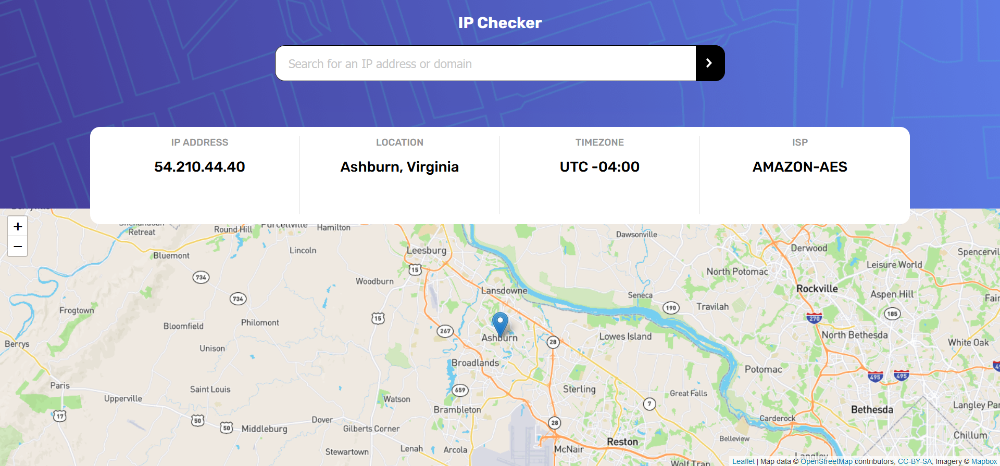

# IP Checker

#### DEPLOYED APP:

## https://ip-checker.onrender.com/

---

#### DESCRIPTION:

A simple node application that uses the Ipify API along with LeafletJS to grab the IP address of the user. A user can also use the search bar to look up IP information about different domains or specific IP addresses.

---

#### AUTHOR:

- Keaton Sentak - [Portfolio](https://keatonsentak.dev) | [GitHub](https://github.com/ksentak)
